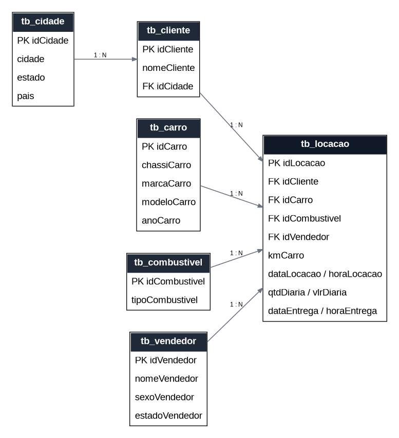
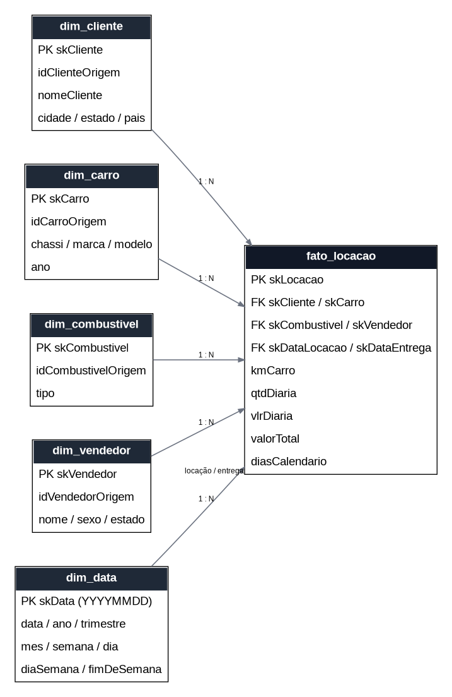

# Modelagem de Banco de Dados: Locadora de Veículos

Projeto de **modelagem relacional e dimensional** para uma locadora de veículos fictícia. A proposta é transformar uma base inicialmente desnormalizada em um modelo relacional com integridade referencial e, a partir dele, construir um modelo dimensional em estrela para consultas analíticas.

## Objetivos

- Aplicar normalização e reduzir redundâncias;
- Definir chaves primárias e estrangeiras;
- Garantir integridade referencial e regras de domínio;
- Organizar dados de clientes, cidades, carros, combustíveis, vendedores e locações;
- Construir um modelo dimensional com dimensões e tabela fato;
- Criar uma dimensão de data reutilizada para **data de locação** e **data de entrega**;
- Disponibilizar consultas analíticas de faturamento, locações e quilometragem.

## Tecnologias

- **SQL**
- **SQLite**
- **Modelagem Relacional**
- **Normalização**
- **Modelagem Dimensional / Star Schema**
- **Data Warehouse — conceitos**

## Estrutura do projeto

```text
modelagem-locadora-veiculos/
├── README.md
├── database/
│   ├── relacional.sqlite
│   └── dimensional.sqlite
├── docs/
│   ├── modelo_relacional.png
│   ├── modelo_relacional.dot
│   ├── modelo_dimensional.png
│   └── modelo_dimensional.dot
├── examples/
│   └── validacao_integridade.sql
└── sql/
    ├── 01_modelo_relacional.sql
    ├── 02_modelo_dimensional.sql
    └── 03_consultas_analiticas.sql
```

## 1. Modelo Relacional

A base de origem possui informações de locação misturadas com atributos de cliente, cidade, carro, combustível e vendedor. O processo de normalização separa essas responsabilidades em entidades próprias.

### Entidades

- `tb_cidade`: cidade, estado e país;
- `tb_cliente`: cadastro de clientes e sua cidade;
- `tb_carro`: características dos veículos;
- `tb_combustivel`: tipos de combustível;
- `tb_vendedor`: cadastro dos vendedores;
- `tb_locacao`: registro de cada locação e suas medidas transacionais.

### Principais melhorias

- Uso de `idCidade` como chave substituta da cidade, evitando relacionamento por texto;
- Foreign keys em `tb_locacao` e `tb_cliente`;
- `UNIQUE` para chassi e combinação cidade/estado/país;
- `CHECK` para valores inválidos de quantidade, preço, quilometragem e sexo;
- Valores monetários representados como `NUMERIC(10,2)`;
- Datas padronizadas no formato ISO `YYYY-MM-DD`;
- Índices para as principais colunas de relacionamento.

### Diagrama



## 2. Modelo Dimensional

O modelo dimensional utiliza um **star schema** com uma linha na tabela fato para cada locação.

### Dimensões

- `dim_cliente`: informações descritivas do cliente;
- `dim_carro`: marca, modelo, ano e chassi;
- `dim_combustivel`: tipo de combustível;
- `dim_vendedor`: informações do vendedor;
- `dim_data`: atributos de calendário para análises por período.

### Tabela fato

`fato_locacao` possui granularidade de **uma linha por locação** e concentra as medidas:

- `qtdDiaria`;
- `vlrDiaria`;
- `valorTotal`;
- `kmCarro`;
- `diasCalendario`.

A `dim_data` é uma **role-playing dimension**: a mesma dimensão é referenciada duas vezes pela fato, uma para `skDataLocacao` e outra para `skDataEntrega`.



## 3. Consultas analíticas

O arquivo `sql/03_consultas_analiticas.sql` contém consultas para:

- faturamento por mês;
- faturamento e quantidade de locações por vendedor;
- carros com maior número de locações;
- desempenho por combustível;
- quilometragem média por carro;
- clientes com maior número de locações.

## 4. Qualidade dos dados

Durante a revisão da base original foi identificada uma inconsistência cronológica no registro `idLocacao = 16`, cuja data de entrega estava anterior à data de locação. O registro foi corrigido para `2022-08-21`, mantendo a sequência temporal das locações e permitindo a aplicação da regra `dataEntrega >= dataLocacao`.

## 5. Como executar

### Modelo relacional

Execute `sql/01_modelo_relacional.sql` em um banco SQLite vazio. O script cria a fonte de staging, normaliza os dados, cria as tabelas finais, insere os registros e cria os índices.

### Modelo dimensional

Com `database/relacional.sqlite` já criado, execute `sql/02_modelo_dimensional.sql`. O script utiliza o banco relacional como origem e materializa as dimensões e a tabela fato em `database/dimensional.sqlite`.

> Se o seu cliente SQLite não resolver o caminho relativo do `ATTACH`, execute o script a partir da pasta `sql/` ou ajuste o caminho para `../database/relacional.sqlite`.

## 6. Resultado

O projeto demonstra o fluxo completo:

```text
Base desnormalizada
        ↓
Normalização
        ↓
Modelo Relacional
        ↓
Transformação / carga
        ↓
Modelo Dimensional
        ↓
Consultas Analíticas
```
